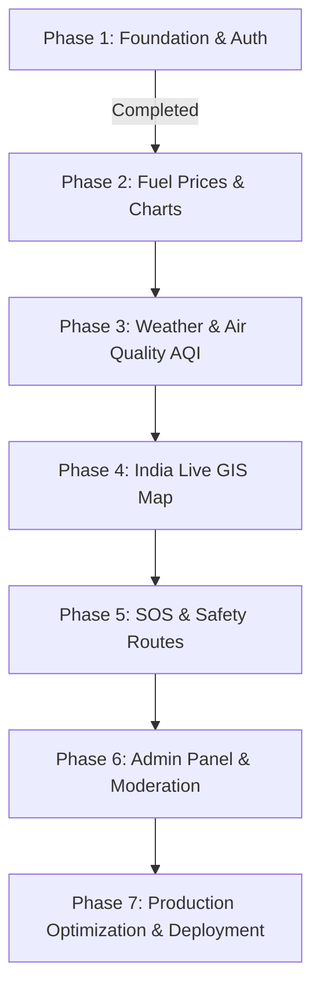

# Smart India Live Monitor (SILM) 🇮🇳

A unified, real-time civic intelligence and monitoring platform designed for Indian citizens to monitor emergency situations, weather conditions, air quality (AQI), fuel prices, traffic, and safety alerts in one centralized dashboard. 

---

## 🚀 Completed Tasks (Phase 1 — Foundation)

We have successfully scaffolded and integrated the initial core framework of this national platform:

### 1. Unified Architecture Scaffold
* **Frontend (`/frontend`)**: Developed with React (Vite), Tailwind CSS v4, Redux Toolkit, React Router DOM, React Query, and Lucide React.
* **Backend (`/backend`)**: Developed using Express.js and Node.js following a Clean MVC + Service + Repository architecture.
* **Database**: Configured MongoDB Atlas connection layer using Mongoose, featuring custom geospatial indexing (`2dsphere`) and automatic TTL indexes.

### 2. Full Security Stack & Middlewares
* **Helmet.js**: Configured to protect against HTTP header vulnerability attacks.
* **CORS**: Enhanced to dynamically accept multiple localhost development ports (`5173`, `5174`, etc.) and block malicious domains.
* **Rate Limiting**: Built endpoint-specific limiters:
  * General API protection (100 requests per 15 minutes).
  * Authentication protection (10 logins/registrations per hour per IP).
  * SOS broadcast limits (5 actions per hour per IP).
* **Data Sanitization**: Integrated `express-mongo-sanitize` to defend against NoSQL injection.

### 3. JWT Authentication Engine
* **Access Tokens**: Short-lived (15 min) JWT tokens sent in authorization header.
* **Refresh Tokens**: Long-lived (7 day) JWT tokens stored securely as `httpOnly` cookies with strict SameSite attributes for CSRF safety.
* **Redux Hook (`useAuth`)**: Integrated a single state hook to manage Login, Registration, Logout, and auto-fetching profiles seamlessly.
* **Route Guards**: Created reusable `<ProtectedRoute>`, `<AdminRoute>`, and `<PublicRoute>` guards.

### 4. Interactive Live Dashboard
* **Metric Cards**: Tracks real-time national petrol/diesel average, local weather, regional AQI severity levels, and critical alerts.
* **Live Alerts Grid**: Interactive lists with color-coded severity levels (Critical, High, Medium, Low) and localized markers.
* **National Helplines**: Dynamic listing of India's main emergency lines (112, 100, 101, 102, 1091, etc.).
* **State Fuel Price Feed**: Comparison cards tracking daily changes across all states.

---

## 🛠️ Environment Configuration (`.env.example`)

We have placed environment configurations inside `/frontend/.env.example` and `/backend/.env.example`.

### Backend `.env` Variables:
```env
NODE_ENV=development
PORT=5000
MONGODB_URI=your_mongodb_connection_string
JWT_ACCESS_SECRET=your_minimum_64_character_access_key
JWT_REFRESH_SECRET=your_minimum_64_character_refresh_key
JWT_ACCESS_EXPIRE=15m
JWT_REFRESH_EXPIRE=7d
CLIENT_ORIGIN=http://localhost:5173
OPENWEATHER_API_KEY=your_key
AQICN_API_KEY=your_key
NEWS_API_KEY=your_key
```

*Note: Both `.env` files are ignored by git via `.gitignore` files in the root, `/frontend` and `/backend` directories.*

---

## 🏁 How to Run the Project Locally

First, clone this repository and follow these instructions:

### Step 1: Backend Setup
1. Open a terminal and navigate to the backend directory:
   ```bash
   cd backend
   ```
2. Install the required Node dependencies:
   ```bash
   npm install
   ```
3. Copy `.env.example` to a new `.env` file and insert your MongoDB connection string and API keys:
   ```bash
   cp .env.example .env
   ```
4. Start the backend development server:
   ```bash
   npm run dev
   ```
   *Runs at `http://localhost:5000`.*

### Step 2: Frontend Setup
1. Open a second terminal window and navigate to the frontend directory:
   ```bash
   cd frontend
   ```
2. Install the required packages:
   ```bash
   npm install
   ```
3. Start the Vite React development server:
   ```bash
   npm run dev
   ```
   *Runs at `http://localhost:5173` (or `http://localhost:5174` if port is occupied).*

---

## 🗺️ Project Status & Implementation Roadmap



* **Current Status**: **Phase 1 Complete**. Core dashboard, user session, and backend API routes are active and connected to MongoDB Atlas.
* **Next Module**: **Phase 2 — Fuel Price Monitor** page with historical price tracking graphs.
