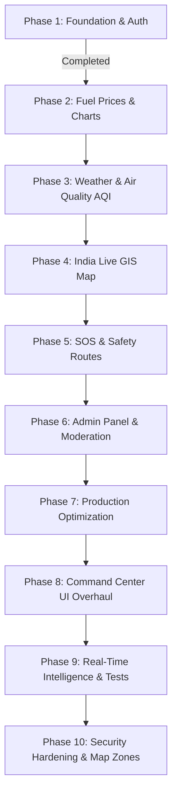

# Smart India Live Monitor (SILM) 🇮🇳

A unified, real-time civic intelligence and monitoring platform designed for Indian citizens. It features an ultra-premium, dark-mode **National Command Center** interface (inspired by futuristic telemetry, glassmorphism, and neon cyberpunk aesthetics) to monitor emergency situations, weather conditions, air quality (AQI), fuel prices, and safety alerts in one centralized dashboard.

---

## 🚀 Completed Tasks (Phases 1 to 8 — Complete Platform)

We have successfully scaffolded, integrated, and verified the complete production-grade SILM stack:

### 1. Unified Architecture Scaffold (Phase 1)
* **Frontend (`/frontend`)**: Developed with React (Vite), Tailwind CSS v4, Redux Toolkit, React Router DOM, React Query, and Lucide React.
* **Backend (`/backend`)**: Developed using Express.js and Node.js following a Clean MVC + Service + Repository architecture.
* **Database**: Configured MongoDB Atlas connection layer using Mongoose, featuring custom geospatial indexing (`2dsphere`) and automatic TTL indexes.

### 2. Fuel Price Monitor (Phase 2)
* **Live API Integration**: Fetches real-time petrol & diesel state-wise data, showing averages.
* **Price History Chart**: Recharts-based 7-day pricing trend lines.
* **State Comparison Panel**: Instant pricing differential calculations.
* **AI Fuel-Saving Tips**: Educational micro-advice on conserving vehicle fuel.

### 3. Weather & Air Quality AQI Monitor (Phase 3)
* **Live Weather**: Integrated OpenWeather API (with robust dynamic mock fallbacks).
* **AQI Pollution Monitor**: Categorized PM2.5, PM10, Ozone (O3), and Nitrogen Dioxide (NO2) tracking.
* **Severe Weather Warnings**: Heatwave and coldwave automatic banners.

### 4. GIS Live Map (Phase 4)
* **Leaflet GIS Integration**: Interactive maps rendering CartoDB Dark Matter layers.
* **Danger Circle Polygons**: Renders radial alert warning buffers based on crisis location coordinates.
* **Filter Controls**: Multi-layer overlays for active alerts, hospitals, and police headquarters.

### 5. Emergency & SOS Response (Phase 5)
* **3-Second SOS Trigger**: Circular active broadcast button with countdown cancellation safety.
* **Near Hospital & Bed Status**: Tracking tool indicating hospital distance and emergency bed availability.
* **First Aid Handbooks**: Collapsible guidelines for stroke, burn, and flood relief.

### 6. Admin Panel & Moderation (Phase 6)
* **Role-Based Access Control (RBAC)**: Protects admin controls, ensuring only authorized user roles modify content.
* **Crisis Alert Publisher**: Panel to broadcast and localize emergency weather alerts.
* **Incoming SOS Dispatch Desk**: Central management system to monitor and dispatch rescue units (e.g. NDRF).
* **User Moderation Dropdowns**: Admin interface to modify registration privileges.

### 7. Production Verification (Phase 7)
* **Zero Warnings Compile**: Verified React build outputs successfully compile with 0 error states.

### 8. National Command Center UI Overhaul (Phase 8)
* **Cinematic Aesthetic**: Upgraded the entire platform to a deep navy and neon-cyan "Command Center" theme.
* **Glassmorphism Components**: Rebuilt all cards, modals, and sidebar navigations with frosted-glass effects and smooth micro-animations.
* **Data Typography**: Integrated monospace styling (`JetBrains Mono`) for telemetry data and financial metrics to ensure high readability.
* **Standardized Layouts**: Audited and fixed all CSS Grid and Flex gaps across every module (Fuel, AQI, Alerts, Safety, Map) for a uniform, premium layout without component overlap.

### 9. Real-Time Intelligence & Test Coverage (Phase 9)
* **Live GDACS RSS Integration**: Connected the backend to the Global Disaster Alert and Coordination System (GDACS) to stream real-time, global disaster geospatial data directly into the map when DB alerts are empty.
* **Auto-Refresh Synchronization**: Implemented dynamic `refetchInterval` overrides across React Query for automatic Dashboard polling (Alerts sync every 30s, Weather/Fuel every 10m) for a true "live" feel.
* **Leaflet Map Overhauls**: Fixed layout bleeds, optimized auto-panning bounds, and applied deep-dark CSS overrides so popups seamlessly match the UI.
* **Integration Testing Suite**: Configured a complete Jest & Supertest environment covering Auth, Emergency, and Fuel API routes with fully mocked Mongoose models.

### 10. Security Hardening & Map Zones (Phase 10)
* **Strict Input Validation**: Implemented comprehensive `Joi` schema-based validation across all public and authenticated endpoints to reject unexpected fields and enforce type constraints.
* **Intelligent Rate Limiting**: Deployed IP and User-ID based rate limiting with sensible defaults (e.g., dedicated strict limits for auth and SOS endpoints) to prevent brute-force attacks and scraping.
* **Secure Key Management**: Audited external API integrations (OpenWeather, AQICN, GDACS) to ensure zero client-side exposure of sensitive tokens.
* **Map Radius Zones**: Enhanced the Leaflet Live Map with dynamic `Circle` layers, visualizing the affected impact radius of emergencies based on alert severity while simultaneously rendering all critical markers.

---

## 🛠️ Environment Configuration (`.env.example`)

We have placed environment configurations inside `/frontend/.env.example` and `/backend/.env.example`.

### Backend `.env` Variables:
```env
NODE_ENV=development
PORT=5000
MONGODB_URI=your_mongodb_connection_string
JWT_ACCESS_SECRET=your_minimum_64_character_access_key
JWT_REFRESH_SECRET=your_minimum_64_character_refresh_key
JWT_ACCESS_EXPIRE=15m
JWT_REFRESH_EXPIRE=7d
CLIENT_ORIGIN=http://localhost:5173
OPENWEATHER_API_KEY=your_key
AQICN_API_KEY=your_key
NEWS_API_KEY=your_key
```

*Note: Both `.env` files are ignored by git via `.gitignore` files in the root, `/frontend` and `/backend` directories.*

---

## 🏁 How to Run the Project Locally

First, clone this repository and follow these instructions:

### Step 1: Backend Setup
1. Open a terminal and navigate to the backend directory:
   ```bash
   cd backend
   ```
2. Install the required Node dependencies:
   ```bash
   npm install
   ```
3. Copy `.env.example` to a new `.env` file and insert your MongoDB connection string and API keys:
   ```bash
   cp .env.example .env
   ```
4. Start the backend development server:
   ```bash
   npm run dev
   ```
   *Runs at `http://localhost:5000`.*

### Step 2: Frontend Setup
1. Open a second terminal window and navigate to the frontend directory:
   ```bash
   cd frontend
   ```
2. Install the required packages:
   ```bash
   npm install
   ```
3. Start the Vite React development server:
   ```bash
   npm run dev
   ```
   *Runs at `http://localhost:5173` (or `http://localhost:5174` if port is occupied).*

---

## 🗺️ Project Status & Implementation Roadmap



* **Current Status**: **All 10 Phases Completed & Verified (Production Ready)**. 
