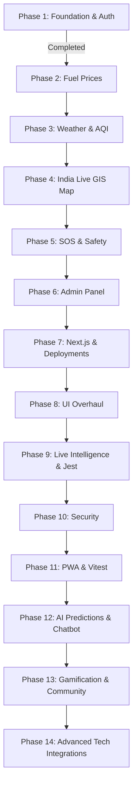

# Smart India Live Monitor (SILM) 🇮🇳

A unified, real-time civic intelligence and monitoring platform designed for Indian citizens. It features an ultra-premium, dark-mode **National Command Center** interface (inspired by futuristic telemetry, glassmorphism, and neon cyberpunk aesthetics) to monitor emergency situations, weather conditions, air quality (AQI), fuel prices, and safety alerts in one centralized dashboard.

---

## 🚀 Completed Tasks (Phases 1 to 12 — Complete Platform & AI)

We have successfully scaffolded, integrated, and verified the complete production-grade SILM stack:

### 1. Unified Architecture Scaffold (Phase 1)
* **Frontend (`/frontend`)**: Developed with **Next.js**, Tailwind CSS v4, Redux Toolkit, React Query, and Lucide React.
* **Backend (`/backend`)**: Developed using Express.js and Node.js following a Clean MVC architecture.
* **Database**: Configured MongoDB Atlas connection layer using Mongoose, featuring custom geospatial indexing (`2dsphere`).

### 2. Fuel Price Monitor (Phase 2)
* **Live API Integration**: Fetches real-time petrol & diesel state-wise data, showing averages.
* **Price History Chart**: Recharts-based 7-day pricing trend lines.

### 3. Weather & Air Quality AQI Monitor (Phase 3)
* **Live Weather**: Integrated OpenWeather API (with robust dynamic mock fallbacks).
* **AQI Pollution Monitor**: Categorized PM2.5, PM10, Ozone tracking.

### 4. GIS Live Map (Phase 4)
* **Leaflet GIS Integration**: Interactive maps rendering CartoDB Dark Matter layers.
* **Danger Circle Polygons**: Renders radial alert warning buffers based on crisis location coordinates.

### 5. Emergency & SOS Response (Phase 5)
* **3-Second SOS Trigger**: Circular active broadcast button with countdown cancellation safety.
* **Near Hospital & Bed Status**: Tracking tool indicating hospital distance.

### 6. Admin Panel & Moderation (Phase 6)
* **Role-Based Access Control (RBAC)**: Protects admin controls.
* **Crisis Alert Publisher**: Panel to broadcast emergency alerts.

### 7. Production Verification & Deployment (Phase 7)
* **Render Deployment**: Configured backend for production deployment on Render.
* **Vercel Edge**: Frontend optimized for Next.js deployments.
* **Dynamic Proxies**: Handled Next.js rewrites to communicate with the Render API seamlessly.

### 8. National Command Center UI Overhaul (Phase 8)
* **Cinematic Aesthetic**: Deep navy and neon-cyan "Command Center" theme.
* **Glassmorphism Components**: Rebuilt all cards, modals, and sidebar navigations with frosted-glass effects.

### 9. Real-Time Intelligence & Backend Testing (Phase 9)
* **Live GDACS RSS Integration**: Streams real-time global disaster geospatial data directly into the map.
* **Integration Testing Suite**: Configured a complete Jest & Supertest environment covering backend routes.

### 10. Security Hardening & Map Zones (Phase 10)
* **Strict Input Validation**: `Joi` schema-based validation across all public and authenticated endpoints.
* **Intelligent Rate Limiting**: Deployed IP and User-ID based rate limiting.

### 11. PWA, Frontend Testing & Mobile Polish (Phase 11)
* **Progressive Web App (PWA)**: Implemented Next-PWA with mobile-friendly manifest and icons for native-like installation.
* **Vitest Integration**: Added Vitest and React Testing Library to ensure frontend component stability.
* **Mobile Responsiveness**: Highly optimized map layouts, sidebars, and responsive grids for smaller screens.

### 12. AI Predictions & Chatbot (Phase 12)
* **National Emergency AI Assistant**: A globally available chatbot widget for instant emergency response guidance and verification.
* **Predictive Engines Pipeline**: Simulated ML predictors for Fuel Trends, 24h AQI Forecasting, and Traffic Congestion.
* **National Intelligence Models**: Disaster Risk Scoring and Fake News/Misinformation Alert Verification endpoints.

### 13. Gamification & Community Trust (Phase 13)
* **Civic Karma System**: Users earn a 'Trust Score' for accurately reporting or verifying civic incidents.
* **National Leaderboard**: A real-time ranking of top citizen responders integrated directly into the dashboard.
* **Automated Verification**: Incident verification status is dynamically managed through crowd-sourced upvotes and flags.

### 14. Advanced Technical Integrations (Phase 14)
* **Multilingual Voice-Activated AI**: The National Emergency AI accepts voice inputs in English, Hindi, and Tamil via the Web Speech API.
* **SMS / WhatsApp Offline SOS Webhook**: Integrated Twilio gateway allows citizens without 4G/5G data to text an SOS that auto-drops a pin on the GIS map.
* **Live Traffic CCTV & IoT Feeds**: Embedded simulated live CCTV feeds directly into the Leaflet map markers for real-time visual confirmation of traffic and crises.

---

## 🛠️ Environment Configuration (`.env.example`)

### Backend `.env` Variables (`/backend/.env`):
```env
NODE_ENV=development
PORT=5000
MONGODB_URI=your_mongodb_connection_string
JWT_ACCESS_SECRET=your_minimum_64_character_access_key
JWT_REFRESH_SECRET=your_minimum_64_character_refresh_key
JWT_ACCESS_EXPIRE=15m
JWT_REFRESH_EXPIRE=7d
CLIENT_ORIGIN=http://localhost:3000
OPENWEATHER_API_KEY=your_key
AQICN_API_KEY=your_key
NEWS_API_KEY=your_key
```

### Frontend `.env` Variables (`/frontend/.env`):
```env
NEXT_PUBLIC_API_BASE_URL=http://localhost:5000
```

---

## 🏁 How to Run the Project Locally

### Step 1: Backend Setup
1. Open a terminal and navigate to the backend directory:
   ```bash
   cd backend
   ```
2. Install dependencies:
   ```bash
   npm install
   ```
3. Copy `.env.example` to `.env` and fill out your keys.
4. Start the backend development server:
   ```bash
   npm run dev
   ```
   *Runs at `http://localhost:5000`.*

### Step 2: Frontend Setup
1. Open a second terminal window and navigate to the frontend directory:
   ```bash
   cd frontend
   ```
2. Install the required packages:
   ```bash
   npm install
   ```
3. Start the Next.js development server:
   ```bash
   npm run dev
   ```
   *Runs at `http://localhost:3000`.*

---

## 🗺️ Implementation Roadmap



* **Current Status**: **Phases 1 to 14 Completed & Verified (Production Ready)**. Full AI, Gamification, and Technical Integrations are live!
